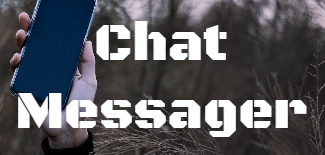
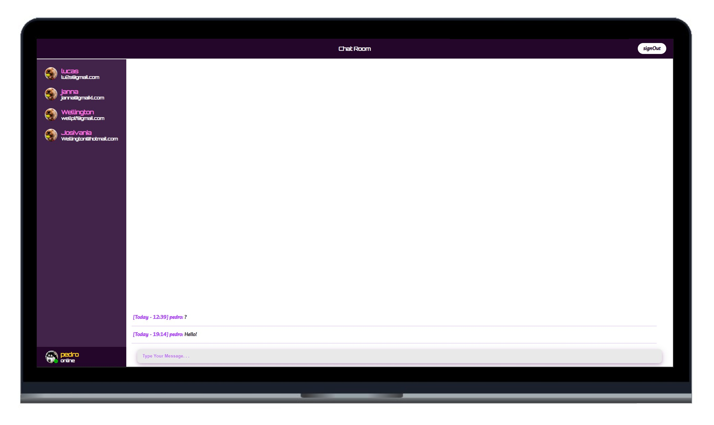

<h1 align="center">
  
</h1>

  <a href="#-tecnologias">Tecnologias</a>&nbsp;&nbsp;&nbsp;|&nbsp;&nbsp;&nbsp;
  <a href="#-projeto">Projeto</a>&nbsp;&nbsp;&nbsp;|&nbsp;&nbsp;&nbsp;
  <a href="#-layout">Layout</a>&nbsp;&nbsp;&nbsp;|&nbsp;&nbsp;&nbsp;
  <a href="#-como-executar">Como executar</a>&nbsp;&nbsp;&nbsp;|&nbsp;&nbsp;&nbsp;
  <a href="#-licença">Licença</a>

  
  

 

  

## ✨ Tecnologias

Esse projeto foi desenvolvido com as seguintes tecnologias:

- [Javascript](https://262.ecma-international.org/5.1/)
- [Scss](https://sass-lang.com/)
- [Vue.js](https://vuejs.org/)
- [Redis](https://redis.io/)
- [Ruby on Rails](https://rubyonrails.org/)
- [PostgreSQL](https://www.postgresql.org/)

## 💻 Projeto

O chatMessager é um chat que viabiliza a conversa entre várias pessoas dentro de um mesmo canal.

## 🔖 Layout

Você pode visualizar o layout do projeto através da pasta prototipagem do próprio repositório.

## 🚀 Como executar

- Clone o repositório:  ⇝ `git clone "..."`
- Instale as dependências: ⇝ `npm i`
- Inicie o servidor: ⇝ `npm run serve`
- <b>Agora leia o README do repositório [BackMessager](https://github.com/wellingtonPLF/backEndMessager) </b>

Agora você pode acessar [`localhost:8080`](http://localhost:8080) do seu navegador.

## 📄 Licença

Esse projeto está sob a licença MIT. Veja o arquivo [LICENSE](LICENSE.md) para mais detalhes.

---

Feito com ♥ by WellingtonPLF 👋🏻 [Contact Me 😊](https://mail.google.com/mail/?view=cm&fs=1&to=wellplf@gmail.com)